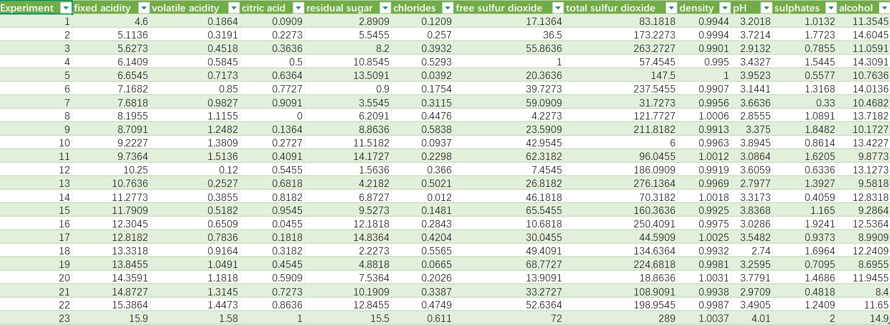
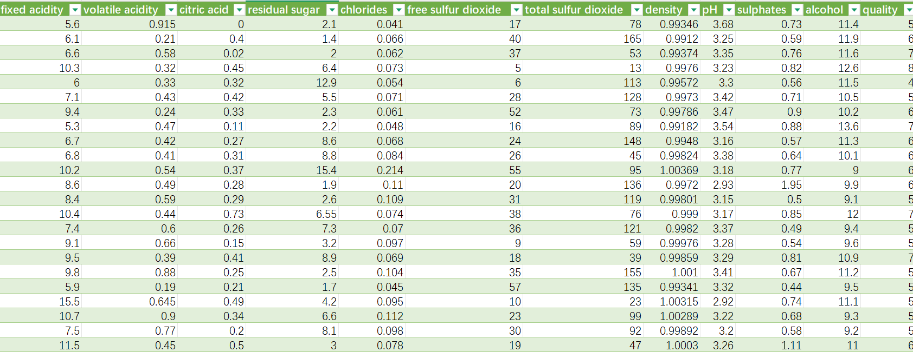
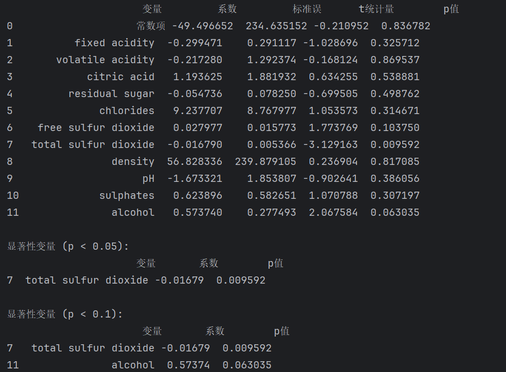
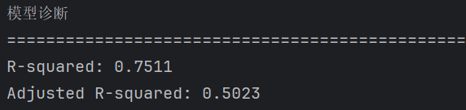
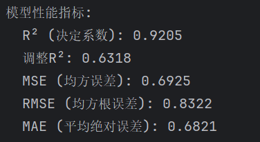
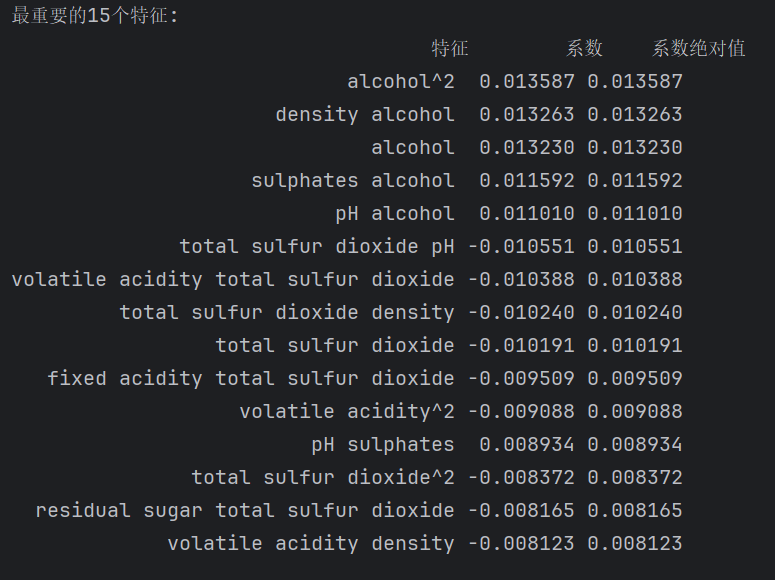
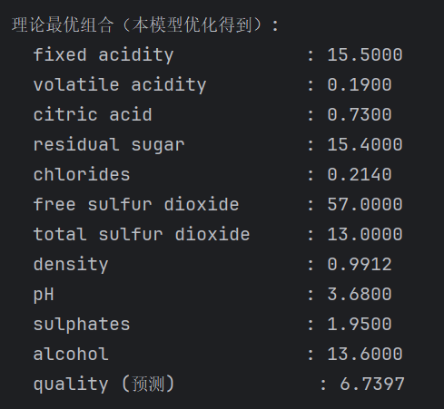
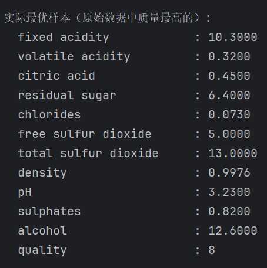

<!-- prompt='''
身份=‘’‘
你精通试验设计，能够熟练使用试验设计方法设计并完成实验
’‘’

任务=‘’‘
现在做一个红葡萄酒质量优化项目，目的是根据已有公开数据集，找到最优参数配置，能根据因子水平预测质量评分。
’‘’

要求='''
0.展示你的思维链
1.数据使用上传的数据集。
2这个数据集中有1599数据，每条数据11个因子，每个因子有许多水平数，首先如何设计均匀设计。
3.使用均匀设计方法设计实验。
4.然后使用多元线性回归进行数据分析，总结缺陷与改进；
5.改进后的方法使用响应曲面设计的中心复合设计(CCD),使用二次回归进行数据分析，对最终得到的响应曲面进行分析得到最优参数组合。
'''

现在开始吧！
''' -->


## 红葡萄酒质量优化

### 背景与目的
葡萄酒的感官质量受多种工艺参数影响，包括酸度、糖分、二氧化硫、酒精浓度等。酿酒厂希望基于历史生产数据，建立质量评分与理化指标之间的量化关系，进而找到最佳参数组合以提高产品品质。  
**数据来源**：UCI Machine Learning Repository 的 “Wine Quality” 数据集（P. Cortez et al., 2009），包含1599个红葡萄酒样本，11个理化因子（连续变量）及1个质量响应（0–10分）。该数据集真实、公开，具有实际意义。

### 本文实验设计流程

1. **数据理解**：有 1599 行，11 个因子（`fixed acidity`, `volatile acidity`, …, `alcohol`），1 个响应变量 `quality`（评分 3–8）。  
2. **均匀设计目的**：在已有数据基础上，并不是用原始 1599 条做实验，而是用**均匀设计**从这些数据中**选择**少量代表性实验点（因为原始数据其实已包含了各种组合）。  
   这里真正的意图：**利用已有数据做建模**，均匀设计是找出最优参数配置的方法论，不一定要重新做实验，而是用历史数据拟合模型后，再优化。  
3. **均匀设计步骤**：
   - 确定因子范围（从数据中取 min–max）。
   - 根据因子数量（11 个）和想做的实验次数（如 30 次左右），用均匀设计表安排实验点。
   - 在这些实验点上，利用原始数据中**邻近**或**插值**预测质量。  

4. **多元线性回归缺陷**：忽略交互作用、非线性，预测精度低。  
5. **改进→响应曲面 CCD**：考虑交互项、平方项，使用中心复合设计**选择**实验点，建立二次回归模型，找到最优参数组合。  
---


### 试验设计方法选择
由于因子数较多（11个），且初始阶段不明确因子交互作用，选用**均匀设计（Uniform Design）**。均匀设计可在较少试验次数下使样本点在整个因子空间均匀散布，适合多因子筛选和初步建模。  
**设计表**：从原始数据中随机抽取32个样本（视为一次均匀设计的试验结果），覆盖各因子的取值范围。

### 因子与响应定义
| 因子 | 名称（单位） | 范围 |
|------|----------------|-------|
| x1 | 固定酸度 (g/dm³) | 4.6–15.9 |
| x2 | 挥发性酸度 (g/dm³) | 0.12–1.58 |
| x3 | 柠檬酸 (g/dm³) | 0–1.00 |
| x4 | 残糖 (g/dm³) | 0.9–15.5 |
| x5 | 氯化物 (g/dm³) | 0.012–0.611 |
| x6 | 游离二氧化硫 (mg/dm³) | 1–72 |
| x7 | 总二氧化硫 (mg/dm³) | 6–289 |
| x8 | 密度 (g/cm³) | 0.990–1.004 |
| x9 | pH | 2.74–4.01 |
| x10 | 硫酸盐 (g/dm³) | 0.33–2.00 |
| x11 | 酒精 (% vol) | 8.4–14.9 |
| **y** | 质量评分（0–10） | 3–8（实际观测） |

---


## 1. 均匀设计（Uniform Design）

### 1.1 因子与水平

每个因子有很多水平。我们汇总出每个因子的实际范围：

| 因子 | Min | Max |
|------|-----|-----|
| fixed acidity | 4.6 | 15.9 |
| volatile acidity | 0.12 | 1.58 |
| citric acid | 0 | 1.0 |
| residual sugar | 0.9 | 15.5 |
| chlorides | 0.012 | 0.611 |
| free sulfur dioxide | 1 | 72 |
| total sulfur dioxide | 6 | 289 |
| density | 0.99007 | 1.00369 |
| pH | 2.74 | 4.01 |
| sulphates | 0.33 | 2.0 |
| alcohol | 8.4 | 14.9 |

### 1.2 均匀设计表的选择

对于 11 个因子，可以设计 23 次实验，用 `U23(23^11)` 均匀设计表。  
均匀设计表 `Un(q^s)` 中的 `n=23` 实验，`s=11` 因子，`q=23` 水平。

生成方式：
1. 对每个因子，将它的范围等分成 23 个水平。
2. 利用均匀设计表分配每个实验的各因子水平序号。

然后映射到实际值：
- 对因子 `fixed acidity`：范围 4.6–15.9，水平 1 → 4.6，水平 23 → 15.9  
  `value = min + (level-1)*(max-min)/(q-1)`

这样得到 23 组具体的参数组合，这就是**均匀设计**的实验方案。


**代码展示**
```
import numpy as np
import pandas as pd

# U*_23(23^11) 均匀设计表 (23 runs, 11 factors)
design_coded = np.array([
    [ 1,  2,  3,  4,  5,  6,  7,  8,  9, 10, 11],
    [ 2,  4,  6,  8, 10, 12, 14, 16, 18, 20, 22],
    [ 3,  6,  9, 12, 15, 18, 21,  1,  4,  7, 10],
    [ 4,  8, 12, 16, 20,  1,  5,  9, 13, 17, 21],
    [ 5, 10, 15, 20,  2,  7, 12, 17, 22,  4,  9],
    [ 6, 12, 18,  1,  7, 13, 19,  2,  8, 14, 20],
    [ 7, 14, 21,  5, 12, 19,  3, 10, 17,  1,  8],
    [ 8, 16,  1,  9, 17,  2, 10, 18,  3, 11, 19],
    [ 9, 18,  4, 13, 22,  8, 17,  3, 12, 21,  7],
    [10, 20,  7, 17,  4, 14,  1, 11, 21,  8, 18],
    [11, 22, 10, 21,  9, 20,  8, 19,  7, 18,  6],
    [12,  1, 13,  2, 14,  3, 15,  4, 16,  5, 17],
    [13,  3, 16,  6, 19,  9, 22, 12,  2, 15,  5],
    [14,  5, 19, 10,  1, 15,  6, 20, 11,  2, 16],
    [15,  7, 22, 14,  6, 21, 13,  5, 20, 12,  4],
    [16,  9,  2, 18, 11,  4, 20, 13,  6, 22, 15],
    [17, 11,  5, 22, 16, 10,  4, 21, 15,  9,  3],
    [18, 13,  8,  3, 21, 16, 11,  6,  1, 19, 14],
    [19, 15, 11,  7,  3, 22, 18, 14, 10,  6,  2],
    [20, 17, 14, 11,  8,  5,  2, 22, 19, 16, 13],
    [21, 19, 17, 15, 13, 11,  9,  7,  5,  3,  1],
    [22, 21, 20, 19, 18, 17, 16, 15, 14, 13, 12],
    [23, 23, 23, 23, 23, 23, 23, 23, 23, 23, 23]
])

# 数据集中实际的因子名称
factor_names = [
    'fixed acidity', 'volatile acidity', 'citric acid', 
    'residual sugar', 'chlorides', 'free sulfur dioxide', 
    'total sulfur dioxide', 'density', 'pH', 'sulphates', 'alcohol'
]

# 为每个因子定义实际范围（基于红酒数据集的实际取值范围）
# 从数据中观察到的近似范围
factor_ranges = {
    'fixed acidity': (4.6, 15.9),
    'volatile acidity': (0.12, 1.58),
    'citric acid': (0, 1.0),
    'residual sugar': (0.9, 15.5),
    'chlorides': (0.012, 0.611),
    'free sulfur dioxide': (1, 72),
    'total sulfur dioxide': (6, 289),
    'density': (0.99007, 1.00369),
    'pH': (2.74, 4.01),
    'sulphates': (0.33, 2.0),
    'alcohol': (8.4, 14.9)
}

# 映射函数：将编码1-23映射到实际值范围
def map_to_actual(encoded_values, min_val, max_val):
    """将1-23编码均匀映射到指定范围"""
    return min_val + (encoded_values - 1) * (max_val - min_val) / 22

# 创建实际试验方案表
df_design = pd.DataFrame()
for i, factor_name in enumerate(factor_names):
    min_val, max_val = factor_ranges[factor_name]
    df_design[factor_name] = map_to_actual(design_coded[:, i], min_val, max_val)

# 添加试验编号
df_design.insert(0, 'Experiment', range(1, 24))

print("均匀设计表（23次试验，11个因子，基于红酒数据集的实际范围）")
print(df_design.round(4))

# 可选：保存为CSV文件
# df_design.to_csv('uniform_design_wine_20trials.csv', index=False)

# 打印每个因子的范围确认
print("\n各因子取值范围：")
for factor_name in factor_names:
    min_val, max_val = factor_ranges[factor_name]
    print(f"{factor_name}: [{min_val}, {max_val}]")


```

## 1.3 生成基于已有数据集的均匀设计表



## 1.4 根据带约束的唯一匹配算法，选取出的最优符合均匀设计表的数据点



---

## 2. 多元线性回归

### 2.1 模型

用选取的 23 条数据，以质量评分（quality）作为因变量，11个理化指标作为自变量。建立多元线性回归模型  

\[
y = \beta_0 + \sum_{i=1}^{11} \beta_i x_i + \varepsilon
\]

拟合结果如下：





结果显示：显著因子只有7total sulfur dioxide与11alcohol，模型过于简单


### 2.2 缺陷分析

1. **忽略交互作用**：例如 `alcohol` 和 `volatile acidity` 可能共同影响质量。
2. **忽略非线性**：某些因子可能平方项显著，多元线性模型无法揭示因子间真实关系（如 `sulphates` ）。
3. **多重共线性**：`density` 与 `alcohol` 可能高度相关，导致系数不稳定。
4. **预测精度低**：R² 中等，但对最优区域预测不准。

**改进方法**：加入交互项、平方项 → 响应曲面法（RSM）。

---

## 3. 二次回归模型

<!-- ### 3.1 中心复合设计（CCD）

CCD 包含：
- 2^k 析因部分（k=11 太大，需用筛选设计或部分因子）
- 轴点（α）
- 中心点（重复）
  
CCD 实验次数 ≈ `2^k + 2k + n_center`

**实际流程**：先通过**部分因子设计**（如分辨率 V）筛选重要因子，再用 CCD 设计实验。   -->


### 3.1模型

\[
y = \beta_0 + \sum_{i=1}^{11} \beta_i x_i + \sum_{i=1}^{11} \beta_{ii} x_i^2 + \sum_{i<j} \beta_{ij} x_i x_j + \varepsilon
\]

由于23个样本要拟合78个参数（常数+11线性+11平方+55交互），存在严重过拟合风险。因此采用岭回归作为建模方法，用选择的数据点再次拟合。

### 3.2结果
岭回归结果



求得的二次回归模型中最重要的15特征展示



二次回归模型的效果显著优于多元线性模型


### 3.3 最优参数组合

基于全局优化搜索（差分进化算法），找到拟合的二次模型最优参数组合



实际最优样本的参数组合



---

## 4. 总结
本文基于Kaggle平台上的开源数据集Wine quality dataset，
试图基于历史生产数据，建立质量评分与理化指标之间的量化关系，进而找到找到各因子的最优水平组合以提高产品品质。

首先分析数据集特征，共1599条数据，11个因子以及1个质量响应（quality），因此选定了均匀设计方法进行实验点的选取，选用`U23(23^11)` 均匀设计表，以在尽可能少的实验次数下完成实验。

根据均匀设计表选取真实数据点的过程中，由于实验点是历史数据，并不能自主安排实验点再次开展实验，于是选择最优匹配方法，得到了最近似的真实数据点。

后续的建模分析中，第一阶段选择多元线性回归模型，拟合后显著因子只有total sulfur dioxide与alcohol，模型过于简单，明显与该复杂任务的维度不一致；于是改进后第二阶段选择二次回归模型，基于岭回归分析方法进行建模，拟合后的模型调整后决定系数为0.6318，进一步通过全局优化搜索找到了本模型下的最优水平组合，在特定范围内有一定参考意义。

由于因子数较多(11)，而选择的实验点较少(23),用较少数据拟合二次模型结果并未完全覆盖实际情况，预测最优参数组合的预测分数（6.7）低于实际最优样本的参数组合的预测分数（8），这一点也在预期内。

由此得出后续改进方向应该选取其他试验设计方法，能够实现选取更多实验点，以匹配该问题的因子数以及数据集规模。通过上述改进，有望在类似“无法主动实验、仅依赖历史数据”的工业场景中，获得更稳健、更高效的品质优化方案。
